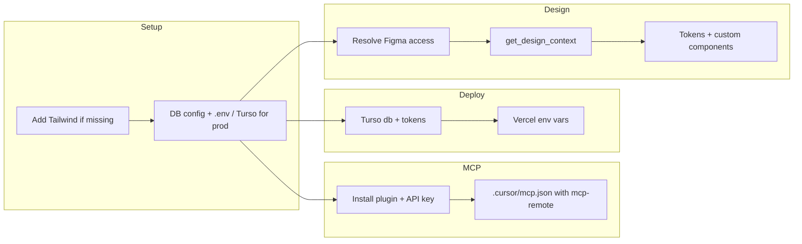

# Next.js + Payload CMS app with Figma design

## 2. Ensure Tailwind + TypeScript

- **TypeScript:** Already provided by the blank template; keep existing `tsconfig.json`.
- **Tailwind:** If the generated app has no Tailwind:
  - Install: `tailwindcss`, `@tailwindcss/postcss`, `postcss` (or match your Next.js/Tailwind version).
  - Add PostCSS config and a global CSS file with Tailwind directives.
  - Import that CSS in the root layout (and, if needed, in Payload’s `custom.scss` only for admin, to avoid clashes with your app styles).

No shadcn/ui: do not add shadcn; the UI will be custom from Figma.

## 3. Deployment: Vercel + SQLite (local) / Turso (production)

**Target:** Deploy to Vercel; use SQLite locally and Turso for the SQLite database in production (serverless does not persist local files).

**Local development:**

- When running `create-payload-app`, select **SQLite** and keep the default connection (local file, e.g. `./payload.db` or similar). Payload will create the file on first `pnpm run dev`.
- No Turso required for local dev.

**Production (Vercel) with Turso:**

1. **Turso setup** (before or after first deploy):

- Install Turso CLI and sign in: `turso auth signup` or `turso auth login`.
- Create a database: `turso db create <db-name>` (e.g. `patient-companion-db`).
- Get URL: `turso db show --url <db-name>`.
- Create token: `turso db tokens create <db-name>`.

2. **Payload config** (in the new app’s `payload.config.ts` or equivalent):

- Use `@payloadcms/db-sqlite` with a client that supports Turso (libSQL). Example pattern from [Payload’s Turso guide](https://payloadcms.com/posts/guides/how-to-set-up-payload-with-sqlite-and-turso-for-deployment-on-vercel):

```ts
   db: sqliteAdapter({
     client: {
       url: process.env.DATABASE_URI || 'file:./payload.db',
       authToken: process.env.DATABASE_AUTH_TOKEN || undefined,
     },
   }),


```

- **Local:** `DATABASE_URI` can be unset or point to a local path; omit or leave `DATABASE_AUTH_TOKEN` empty so the adapter uses the local file.
- **Production:** Set `DATABASE_URI` to the Turso URL and `DATABASE_AUTH_TOKEN` to the Turso token so the same config works on Vercel.

3. **Environment variables:**

- **Local (optional):** Only set `DATABASE_URI` / `DATABASE_AUTH_TOKEN` if you want to point local dev at Turso (e.g. to test production DB).
- **Vercel:** In the project’s Environment Variables, set:
  - `DATABASE_URI` = Turso database URL (from `turso db show --url <db-name>`).
  - `DATABASE_AUTH_TOKEN` = Turso auth token (from `turso db tokens create <db-name>`).
  - Plus any existing Payload vars (e.g. `PAYLOAD_SECRET`).

4. **Vercel deploy:** Connect the repo (e.g. `patient-companion-app`) to Vercel, add the env vars above, and deploy. No extra build steps required; Payload runs inside the Next.js app.

**Reference:** [How to set up Payload with SQLite and Turso for deployment on Vercel](https://payloadcms.com/posts/guides/how-to-set-up-payload-with-sqlite-and-turso-for-deployment-on-vercel).

## 4. MCP (Model Context Protocol) for Cursor

Set up the **official** Payload MCP plugin so Cursor can talk to your Payload CMS (collections, CRUD, custom tools/prompts/resources). Follow [Payload’s MCP plugin docs](https://payloadcms.com/docs/plugins/mcp).

### 4.1 Install and configure the plugin

- **Install:** Inside `patient-companion-app/`, run:

```bash
  pnpm add @payloadcms/plugin-mcp


```

- **Payload config:** In the app’s Payload config (e.g. `payload.config.ts`), add the plugin and enable MCP for the collections you want exposed:

```ts
  import { mcpPlugin } from '@payloadcms/plugin-mcp'

  // In buildConfig({ ... }):
  plugins: [
    mcpPlugin({
      collections: {
        posts: { enabled: true },   // or your collection slugs
        users: { enabled: true },
        // Add descriptions to help the model: description: '...'
      },
    }),
  ],


```

- **Start the app:** Ensure the dev server runs (e.g. `pnpm run dev`) so the MCP endpoint is available at `http://localhost:3000/api/mcp`.

### 4.2 Create an MCP API key

1. Open the Payload admin: `http://localhost:3000/admin`.
2. Go to **MCP → API Keys**.
3. Click **Create New**, set permissions per collection (find, create, update, delete as needed), then **Create**.
4. Copy the generated API key and keep it secret (you’ll use it in Cursor).

### 4.3 Cursor MCP configuration

Payload’s docs recommend using **mcp-remote** so Cursor connects to the running Payload server over HTTP. Configure Cursor as in [Payload’s Cursor instruction](https://payloadcms.com/docs/plugins/mcp#cursor):

**Option A – Project-level (recommended for this app):** In the **patient-companion-app** project, create or edit `.cursor/mcp.json`:

```json
{
  "mcpServers": {
    "Payload": {
      "command": "npx",
      "args": [
        "-y",
        "mcp-remote",
        "http://localhost:3000/api/mcp",
        "--header",
        "Authorization: Bearer YOUR_API_KEY_HERE"
      ]
    }
  }
}
```

Replace `YOUR_API_KEY_HERE` with the API key from step 4.2. Use `http://127.0.0.1:3000/api/mcp` if you prefer loopback. Ensure the Payload dev server is running when using Cursor with this MCP server.

**Option B – User-level:** Same JSON can go in `~/.cursor/mcp.json` (or `%USERPROFILE%\.cursor\mcp.json` on Windows) if you want Payload MCP available in all projects; still replace the bearer token with your API key.

- **Restart Cursor** after changing MCP config so it picks up the new server.
- **Security:** Do not commit the real API key. Use a placeholder in committed `mcp.json` and set the real key locally, or use Cursor’s env/substitution if supported.

**Reference:** [Payload MCP Plugin docs](https://payloadcms.com/docs/plugins/mcp) (installation, options, Cursor/VSCode examples, custom tools/prompts/resources).

## 5. Figma design (Patient Companion App)

**Design URL:** [Developer Case | Patient Companion App](https://www.figma.com/design/VP3fH5x416pnQgUNtrxCuV/Developer-Case-%7C-Patient-Companion-App?node-id=9-1262)  
**Figma MCP parameters:**

- `fileKey`: `VP3fH5x416pnQgUNtrxCuV`
- `nodeId`: `9:1262` (Figma API uses colon; the URL uses `9-1262`)

**Current issue:** A call to the Figma MCP tool `get_design_context` with that file and node returned an access error (“This figma file could not be accessed”). Common causes ([Figma plans and permissions](https://www.figma.com/mcp-catalog/)):

- The file is not shared with the Figma account linked to the MCP server.
- Rate limits (e.g. View/Collab seats have very low limits).

**Plan once access works:**

1. **Verify access:** Ensure the Figma file is shared with the same account used by the Figma MCP (and that the account has at least view access). Optionally run the Figma MCP `whoami` tool to confirm the authenticated user.
2. **Fetch design context:** Call `get_design_context` with:

- `fileKey`: `VP3fH5x416pnQgUNtrxCuV`
- `nodeId`: `9:1262`

3. **Use the response:** Treat the returned code and screenshot as a reference only. Implement in the new app by:

- Mapping design tokens (e.g. colors, spacing, typography) to Tailwind (theme in `tailwind.config` or CSS variables).
- Building custom React components that match the screenshot and structure, without introducing shadcn.
- Keeping Payload admin and API unchanged; only the front-end in your app route group follows the Figma design.

If the file stays inaccessible, you can still implement the Patient Companion UI manually using screenshots or exports from Figma (e.g. shared by a teammate).

## 6. Suggested order of work



1. Add Tailwind (and PostCSS) if the template doesn’t include them; keep TypeScript as-is. Use **pnpm** for installs (e.g. `pnpm add tailwindcss @tailwindcss/postcss`).
2. Configure Payload DB config to support both local file (default) and Turso via `DATABASE_URI` / `DATABASE_AUTH_TOKEN`. Use `.env` locally; no Turso vars needed for local dev unless you want to test against Turso.
3. **MCP:** Install `@payloadcms/plugin-mcp`, add `mcpPlugin` to Payload config, create an API key in Admin → MCP → API Keys, then add Cursor config in `patient-companion-app/.cursor/mcp.json` using `mcp-remote` and the Bearer token (see [Payload MCP docs](https://payloadcms.com/docs/plugins/mcp)). Restart Cursor after editing MCP config.
4. For production: create a Turso database and tokens, then set `DATABASE_URI` and `DATABASE_AUTH_TOKEN` in Vercel. Deploy the app to Vercel (Vercel will use pnpm if it detects `pnpm-lock.yaml`).
5. Fix Figma file access for the MCP-linked account, then call `get_design_context` with the file key and node ID above.
6. Implement design: Tailwind theme + custom components (no shadcn) based on the design context and variables from Figma.

## 7. Summary

| Item         | Approach                                                                                                                                                    |
| ------------ | ----------------------------------------------------------------------------------------------------------------------------------------------------------- |
| **Stack**    | Next.js (App Router), Payload CMS, TypeScript, Tailwind; no shadcn (app already scaffolded with create-payload-app)                                        |
| **Database** | Local: SQLite file. Production (Vercel): Turso (set `DATABASE_URI`, `DATABASE_AUTH_TOKEN` in Vercel)                                                        |
| **Deploy**   | Vercel; add Turso URL and auth token as env vars; Payload runs inside Next.js                                                                               |
| **MCP**      | `@payloadcms/plugin-mcp`; API key from Admin; Cursor: `.cursor/mcp.json` with `mcp-remote` + Bearer token ([docs](https://payloadcms.com/docs/plugins/mcp)) |
| **Figma**    | Use MCP `get_design_context` with fileKey `VP3fH5x416pnQgUNtrxCuV`, nodeId `9:1262` once the file is accessible; then map tokens and build custom UI        |

Next steps: add Tailwind if needed, set up MCP for Cursor, wire Turso for production, and apply the Figma-driven design.
